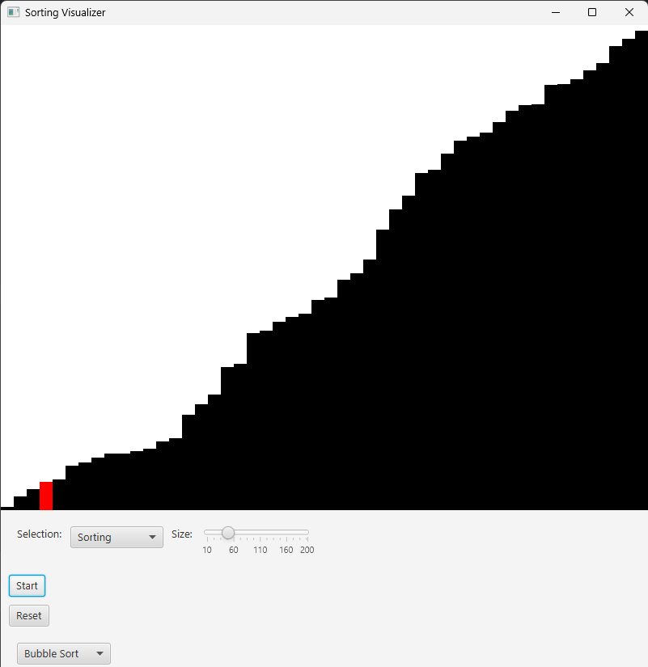

# Data-Structures-Visualised

A continuation of my DSA repo with JavaFX.

## Algorithms
- Sorting
    - Bubble Sort
- Searching
- Pathfinding

## Current State

## TODO

- [ ] More algorithms.
- [ ] Create Library SO in C++ / JNI.
- [ ] Compartmentalize the code for JavaFX standards.
- [ ] Add more scenes for DSA concepts.